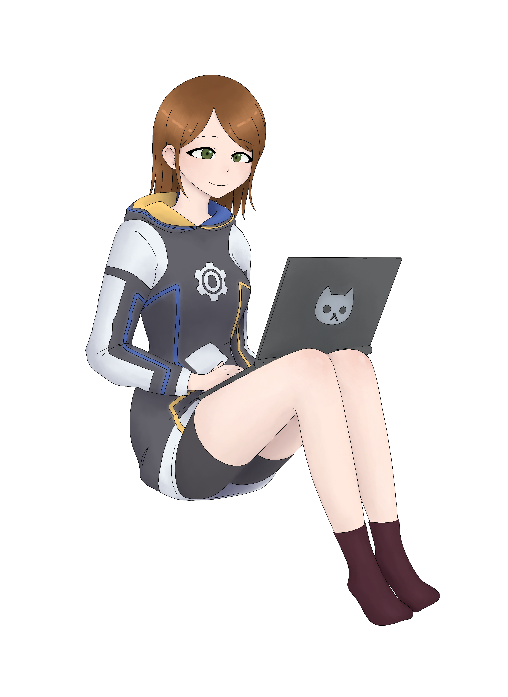
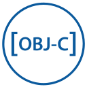
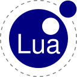

### Hi, I'm Lucy! <3

I'm rather good with computers (seriously, it's my only talent), and program a lot, often out of boredom. Feel free to look at, take inspiration from, contribute to, or use my projects!

#### 👩 About Me

 - 😊 Gender: 🏳️‍⚧️ female, [she/her](https://pronoun.is/she/her) pronouns
 - 🌱 Hobbies: programming, talking to whoever will listen.
 - 🔭 Interested in:
   - 📱 iOS tweaking/development
   - 🔑 Encryption
   - 🛡️ Security
   - 🔐 Copy protection/code obfuscation
 - 🛠 I know  Rust,  Swift,  Objective-C,  C,  Lua,  JavaScript, and  some C++ (from most knowledge to least knowledge). <!-- All icons from https://devicon.dev -->
 - 😂 Say my username (Absolushe) out loud. It's a nice pun, isn't it?

#### 💬 Contact me

* <a href="https://twitter.com/Absolushe" target="blank"> @Absolushe</a>
* 📧 [aspen@aspenuwu.me](mailto:aspen@aspenuwu.me) for inquries, questions, and such, and [support@aspenuwu.me](mailto:support@aspenuwu.me) if you need support with some of my software.
